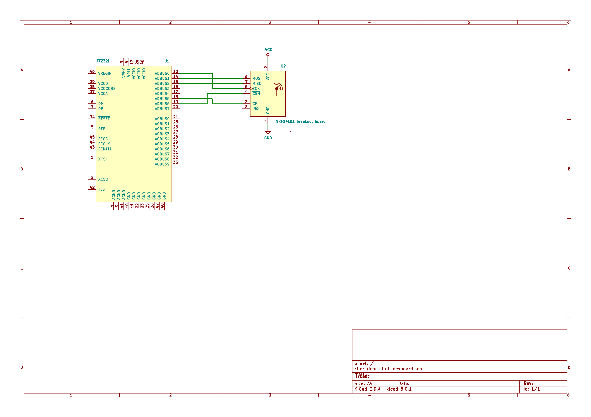
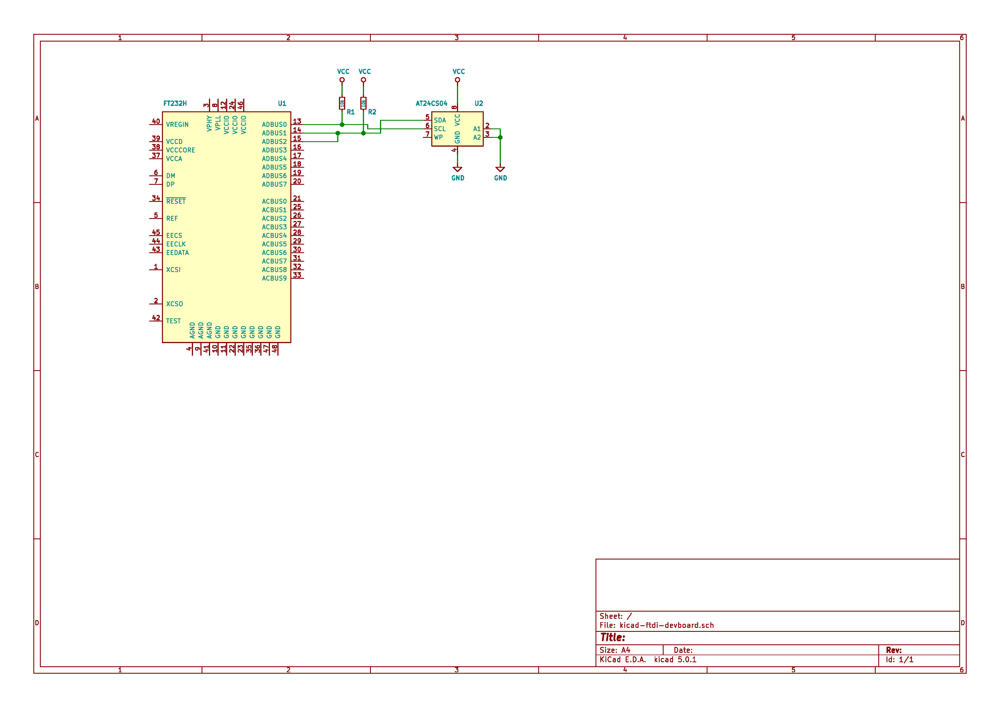

# NOTE

Check new [ftdi-embedded-hal](https://github.com/ftdi-rs/ftdi-embedded-hal) project in the [ftdi-rs](https://github.com/ftdi-rs) organization for the up-to-date implementation of FTDI MPSSE embedded HAL.

---

# `ftdi-embedded-hal`
Implementation of the [embedded-hal](https://crates.io/crates/embedded-hal) traits for [FTDI chips](https://www.ftdichip.com) supporting [Multi Protocol Synchronous Serial Engine (MPSSE)](https://www.ftdichip.com/Support/SoftwareExamples/MPSSE/LibMPSSE-SPI.htm).

This implementation of `embedded-hal` allows you to work with various SPI/I2C devices over USB. If your Linux board has accessible I2C or SPI pins, then it is possible to connect I2C/SPI devices directly. For this purpose [`linux-embedded-hal`](https://github.com/rust-embedded/linux-embedded-hal) implementation of `embedded-hal` traits can be used. However normal Linux workstations usually do not have direct access to SPI/I2C, but have enough USB ports. In this case `ftdi-embedded-hal` can be used. For instance, this may come particularly handy for playing with various I2C/SPI devices, e.g. trying them out or working on driver development.

## Devices
Currently support for GPIO/SPI/I2C on FT232H and FT2232H chips has been implemented. There are many development boards and modules for FTDI chips.
The following modules have been used for development and testing:
- FT232H development module [UM232H](https://www.ftdichip.com/Products/Modules/DevelopmentModules.htm#UM232H)
- FT232H development module [CJMCU-232H](https://www.elecrow.com/cjmcu-ft232h-high-speed-multifunctional-usb-to-jtag-uart-fifo-spi-i2c-module-for-arduino.html)
- [FT2232H development module](https://aliexpress.com/item/EYEWINK-FT2232HL-development-board-learning-board-FT2232H-MINI-FT4232H-UM232H-development-board/32806818411.html)

## Features, limitations, TODO
Brief list of features supported out of the box:
- supported devices: FT232H, FT2232H
- MPSSE mode is supported, no pure bit-banging support
- SPI/I2C/GPIO support
  - SPI
    - MODE0, MODE2
    - 500kHz, 1MHz, 3MHz, 5MHz
  - I2C bus
    - 100kHz, 400kHz
  - GPIO
    - output mode only

Limitations:
- FTDI device is selected by USB PID/VID, so only the first connected device will be handled
- no gpio input support
- i2c/spi are mutually exclusive due to h/w circuitry (not sure if anything can be done from s/w side to support both simultaneously)
- GPIO functionality is disabled for ADBUS[0..3] and BDBUS[0..4] pins (SK/DI/DO/CS)
- no support for SPI MODE1 and MODE3 (not sure if anything can be done from s/w side as this is a limitation for FTDI chips)
- not enough flexibility in clock selection
  - fixed list of suppported SPI/I2C frequencies
  - clock is selected once for the first bus instance and should be the same for all the other bus instances, runtime changes are not supported
- tests can be run only when FTDI devices are connected

TODO:
- [ ] more cleanup and refactoring in terms of idiomatic Rust
- [ ] suppport several connected FTDI devices with the same USB PID/VID
- [ ] enable ADBUS[0..3] and BDBUS[0..3] pins as GPIO pins as well, just keep track of selected functionality, it is already done anyway to disable i2c and spi at the same time
- [ ] add gpio input support
- [ ] add support for FT4232H
- [ ] more flexibility in clock configuration (?)
- [ ] add more I2C/SPI/GPIO examples/tests, e.g. 74HC595, [MCP3008](https://crates.io/crates/mcp3008), [PCF8574](https://crates.io/crates/pcf857x), and more

## Circuit examples
### SPI nRF24L01+ breakout board

### I2C EEPROM at24c04

## Useful documents and links
Projects
- [`ftdi` - Rust wrapper over libftdi1 library for FTDI devices](https://crates.io/crates/ftdi)
- [`embedded-hal` - Hardware Abstraction Layer (HAL) for embedded systems](https://crates.io/crates/embedded-hal)
- [`linux-embedded-hal` - implementation of the `embedded-hal` traits for Linux devices](https://github.com/rust-embedded/linux-embedded-hal)
- [device driver crates that use `embedded-hal` interface](https://github.com/rust-embedded/awesome-embedded-rust#driver-crates)

Data sheets for FTDI chips and development modules:
- [FT232H datasheet](https://www.ftdichip.com/Support/Documents/DataSheets/ICs/DS_FT232H.pdf)
- [FT2232H datasheet](https://www.ftdichip.com/Support/Documents/DataSheets/ICs/DS_FT2232H.pdf)
- [UM232H module datasheet](https://www.ftdichip.com/Support/Documents/DataSheets/Modules/DS_UM232H.pdf)

Application notes provided by FTDI:
- [AN 135: FTDI MPSSE Basics](https://www.ftdichip.com/Support/Documents/AppNotes/AN_135_MPSSE_Basics.pdf)
- [AN 108: Command Processor for MPSSE and MCU Host Bus Emulation Modes](https://www.ftdichip.com/Support/Documents/AppNotes/AN_108_Command_Processor_for_MPSSE_and_MCU_Host_Bus_Emulation_Modes.pdf)
- [AN 113: Interfacing FT2232H Hi-Speed Devices to I2C Bus](https://www.ftdichip.com/Support/Documents/AppNotes/AN_113_FTDI_Hi_Speed_USB_To_I2C_Example.pdf)
- [AN 114: Interfacing FT2232H Hi-Speed Devices to SPI Bus](https://www.ftdichip.com/Support/Documents/AppNotes/AN_114_FTDI_Hi_Speed_USB_To_SPI_Example.pdf)
- [Interfacing FTDI USB Hi-Speed Devices to a JTAG TAP](https://www.ftdichip.com/Support/Documents/AppNotes/AN_129_FTDI_Hi_Speed_USB_To_JTAG_Example.pdf)
